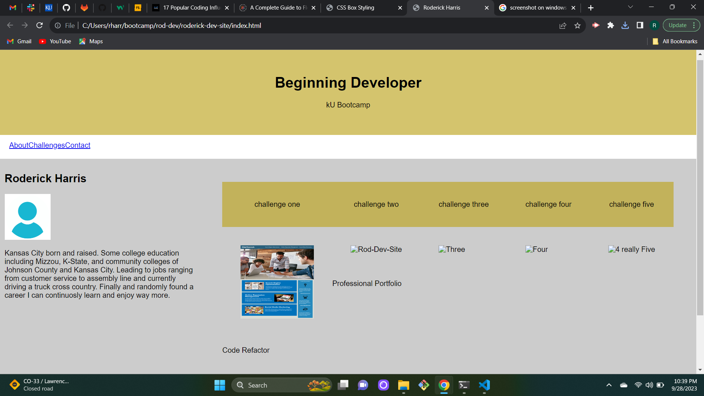

# Roderick-Dev-Site

## Description

Motivation for this project is to have an active showcase for the skills I have learned during this course. While actively updating it I get practice to put lessons to use. I believe this would easily show what I am able to do to potential employers and peers. At the time of this project I have learned HTML, CSS and Github.

## Usage

Website scrolls to corresponding section when navbar link is clicked. Website navigates from image to deployed website. Devtools able to show chage of settings when resized. 

 

## License

*No license selected for challenge. If you need help choosing a license, refer to [https://choosealicense.com/](https://choosealicense.com/).
